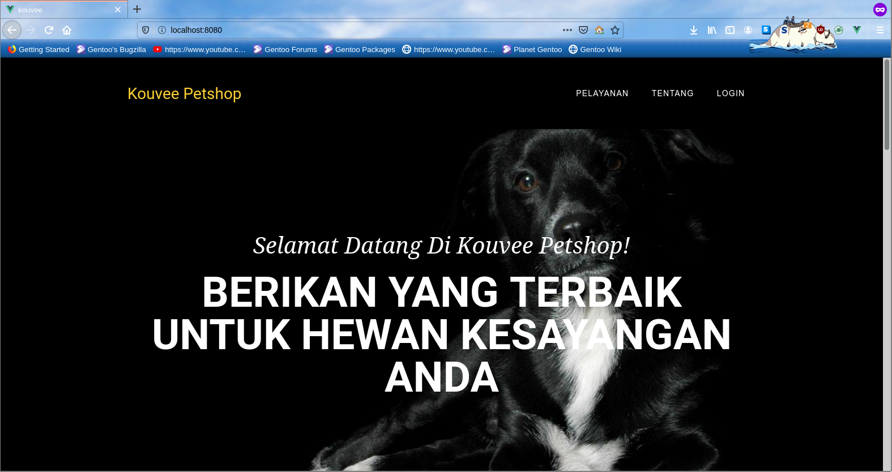

# Kouvee Petshop Frontend
<p align="center">

</p>
This is the frontend version of Pengembangan Projek Perangkat Lunak's final submission.

## Project setup
```
npm install
```

### Compiles and hot-reloads for development
```
npm run serve
```

### Compiles and minifies for production
```
npm run build
```

### Lints and fixes files
```
npm run lint
```

### Customize configuration
See [Configuration Reference](https://cli.vuejs.org/config/).

## Contributors
1. [Natan Hari Pamungkas](https://github.com/natanhp)
2. [Yakobus Nobel Judo Prajitno](https://github.com/YakobusNobels)
3. [Arum Puspa Belinda](https://github.com/arumbelinda)
4. [Adelbertus Larry](https://github.com/L4rryToru4n)